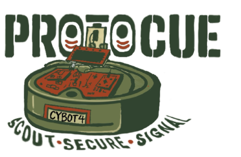

  

<h1 align="center">ProtoCue</h1>

<strong>Embedded Systems Final Project (CPRE 288)</strong>

<em>Scout · Secure · Signal</em>

---

## Overview
ProtoCue is a sensor-driven embedded system developed as the final project for **CPRE 288 – Introduction to Embedded Systems** at Iowa State University. The project emphasizes low-level C firmware development, real-time system behavior, and direct hardware control on an ARM-based microcontroller.

All functionality was implemented using **register-level C programming**, without high-level abstraction libraries, to demonstrate a strong understanding of microcontroller architecture, peripherals, and timing constraints.

---

## Hardware & Tools
- **Microcontroller:** TM4C123 (ARM Cortex-M4)
- **IDE:** Code Composer Studio
- **Peripherals:** GPIO, Timers (PWM & input capture), ADC, UART, NVIC interrupts

---

## System Capabilities
- Digital and peripheral I/O using GPIO and pin multiplexing  
- Timer-driven control for periodic tasks and PWM generation  
- Analog sensor input through ADC sampling  
- UART-based serial communication for debugging and data output  
- Interrupt-driven execution for responsive real-time behavior  

---

## Software Design
The firmware is written in C and organized around:
- Hardware and peripheral initialization  
- Real-time execution logic  
- Interrupt service routines (ISRs)  

Development was guided directly by the microcontroller datasheet and reference manual to ensure precise and predictable hardware control.

---

## Project Results – ProtoCue
ProtoCue is a functional embedded prototype demonstrating autonomous sensing and real-time responsiveness.

**Results:**
- Successfully integrated multiple sensors with reliable real-time data acquisition  
- Achieved stable timing behavior using hardware timers and interrupts  
- Improved system responsiveness through interrupt-based execution  
- Validated system behavior through repeated testing and live demonstrations  

ProtoCue met all core functional requirements and serves as a proof-of-concept for low-level embedded system design.

---

## Repository Structure
- README.md – Project overview and documentation
- media/ – Logos, demo images, and videos
- src/ – Embedded C source code
- docs/ – Final project report and supporting documentation

---

## Author
**Shun Quinlan**  
Electrical Engineering – Embedded Systems  
Iowa State University
